<div align="center">

<!-- Animated Header Wave -->


```
╔═══════════════════════════════════════════════════════════════════════════════╗
║                                                                               ║
║   █████╗ ██╗  ██╗ █████╗ ███████╗██╗  ██╗    ███╗   ██╗ █████╗  ██████╗  █████╗ ██████╗  ║
║  ██╔══██╗██║ ██╔╝██╔══██╗██╔════╝██║  ██║    ████╗  ██║██╔══██╗██╔════╝ ██╔══██╗██╔══██╗ ║
║  ███████║█████╔╝ ███████║███████╗███████║    ██╔██╗ ██║███████║██║  ███╗███████║██████╔╝ ║
║  ██╔══██║██╔═██╗ ██╔══██║╚════██║██╔══██║    ██║╚██╗██║██╔══██║██║   ██║██╔══██║██╔══██╗ ║
║  ██║  ██║██║  ██╗██║  ██║███████║██║  ██║    ██║ ╚████║██║  ██║╚██████╔╝██║  ██║██║  ██║ ║
║  ╚═╝  ╚═╝╚═╝  ╚═╝╚═╝  ╚═╝╚══════╝╚═╝  ╚═╝    ╚═╝  ╚═══╝╚═╝  ╚═╝ ╚═════╝ ╚═╝  ╚═╝╚═╝  ╚═╝ ║
║                                                                               ║
╚═══════════════════════════════════════════════════════════════════════════════╝
```


</div>

<!-- Animated Divider -->


## 

```yaml
name: Akash Nagar
location: India 🇮🇳
role: Aspiring Data Scientist
focus: Python | SQL | AI/ML
status: Learning & Building
```

I am a student from India preparing for a career in **Data Science & AI**. I enjoy working with data, databases, and problem-solving using **Python** and **SQL**. Currently practicing SQL with real-world datasets and doing Python data analysis.

<br clear="right"/>

<!-- Animated Divider -->


## 

```bash
$ cat ~/projects/active.log

[+] SQL practice using World DB and Employee DB
[+] Python-based data analysis projects
[+] Building foundational ML knowledge
```

<!-- Animated Divider -->


## 

<table>
<tr>
<td valign="top" width="50%">

### Programming & Query Languages
<a href="#"></a>
<a href="#"></a>
<a href="#"></a>
<a href="#"></a>

### Databases
<a href="#"></a>
<a href="#"></a>

</td>
<td valign="top" width="50%">

### Data Analysis
<a href="#"></a>
<a href="#"></a>
<a href="#"></a>
<a href="#"></a>

### Machine Learning (Basics)
<a href="#"></a>
<a href="#"></a>

</td>
</tr>
</table>

<!-- Animated Divider -->


## 

<p align="center">
<a href="#"></a>
</p>

<p align="center">
<a href="#"></a>
<a href="#"></a>
<a href="#"></a>
<a href="#"></a>
<a href="#"></a>
</p>

<!-- Animated Divider -->


## 

<div align="center">

| 🚀 Project | 📝 Description | 📊 Status |
|:----------:|:---------------|:---------:|
|  **World Database Analysis** | Querying and analyzing global data patterns |  |
|  **Data Analysis** | EDA and visualization projects |  |
|  **Mini ML Projects** | Foundational machine learning implementations |  |

</div>

<!-- Animated Divider -->


## 

<div align="center">


</div>

<!-- Animated Divider -->


## 

> **⚠ TRANSMISSION INCOMING:** The following represents my planned learning path and future goals.

```
╔══════════════════════════════════════════════════════════════════════════════════════════════╗
║  ░░░░░░░░░░░░░░░░░░░░░░░░░░░░░░░░░░░░░░░░░░░░░░░░░░░░░░░░░░░░░░░░░░░░░░░░░░░░░░░░░░░░░░░░░░  ║
║  ░░██████╗░░░░██╗░░░██╗░██████╗░████████╗███████╗███╗░░░███╗░░░██████╗░░░█████╗░██████╗░░░  ║
║  ░██╔════╝░░░░╚██╗░██╔╝██╔════╝░╚══██╔══╝██╔════╝████╗░████║░░██╔════╝░░██╔══██╗██╔══██╗░░  ║
║  ░╚█████╗░░░░░░╚████╔╝░╚█████╗░░░░░██║░░░█████╗░░██╔████╔██║░░╚█████╗░░░███████║██║░░██║░░  ║
║  ░░╚═══██╗░░░░░░╚██╔╝░░░╚═══██╗░░░░██║░░░██╔══╝░░██║╚██╔╝██║░░░╚═══██╗░░██╔══██║██║░░██║░░  ║
║  ░██████╔╝██╗░░░░██║░░░██████╔╝░░░░██║░░░███████╗██║░╚═╝░██║░░██████╔╝░░██║░░██║██████╔╝░░  ║
║  ░╚═════╝░╚═╝░░░░╚═╝░░░╚═════╝░░░░░╚═╝░░░╚══════╝╚═╝░░░░░╚═╝░░╚═════╝░░░╚═╝░░╚═╝╚═════╝░░░  ║
║  ░░░░░░░░░░░░░░░░░░░░░░░░░░░░░░░░░░░░░░░░░░░░░░░░░░░░░░░░░░░░░░░░░░░░░░░░░░░░░░░░░░░░░░░░░░  ║
╠══════════════════════════════════════════════════════════════════════════════════════════════╣
║                                                                                              ║
║  [SECTOR_01] ▸▸ ARTIFICIAL INTELLIGENCE / MACHINE LEARNING                                  ║
║  ╠══════════════════════════════════════════════════════════════════════════════════════════╣
║  ║  ◈ Machine Learning ─────────────────────────────────────────────────── [ QUEUED ]       ║
║  ║  ◈ Deep Learning ────────────────────────────────────────────────────── [ QUEUED ]       ║
║  ║  ◈ Natural Language Processing ──────────────────────────────────────── [ QUEUED ]       ║
║  ║  ◈ Generative AI ────────────────────────────────────────────────────── [ QUEUED ]       ║
║  ║  ◈ Agentic AI ───────────────────────────────────────────────────────── [ QUEUED ]       ║
║                                                                                              ║
║  [SECTOR_02] ▸▸ BIG DATA ENGINEERING                                                        ║
║  ╠══════════════════════════════════════════════════════════════════════════════════════════╣
║  ║  ◈ Hadoop & HDFS ────────────────────────────────────────────────────── [ QUEUED ]       ║
║  ║  ◈ MapReduce ────────────────────────────────────────────────────────── [ QUEUED ]       ║
║  ║  ◈ Apache Hive ──────────────────────────────────────────────────────── [ QUEUED ]       ║
║  ║  ◈ Apache Spark ─────────────────────────────────────────────────────── [ QUEUED ]       ║
║                                                                                              ║
║  [SECTOR_03] ▸▸ DATA PLATFORMS                                                              ║
║  ╠══════════════════════════════════════════════════════════════════════════════════════════╣
║  ║  ◈ Databricks ───────────────────────────────────────────────────────── [ QUEUED ]       ║
║  ║  ◈ Snowflake ────────────────────────────────────────────────────────── [ QUEUED ]       ║
║                                                                                              ║
║  [SECTOR_04] ▸▸ DATA PIPELINES                                                              ║
║  ╠══════════════════════════════════════════════════════════════════════════════════════════╣
║  ║  ◈ ETL Concepts ─────────────────────────────────────────────────────── [ QUEUED ]       ║
║  ║  ◈ Apache Kafka ─────────────────────────────────────────────────────── [ QUEUED ]       ║
║                                                                                              ║
║  [SECTOR_05] ▸▸ CLOUD & BUSINESS INTELLIGENCE                                               ║
║  ╠══════════════════════════════════════════════════════════════════════════════════════════╣
║  ║  ◈ Amazon Web Services (AWS) ────────────────────────────────────────── [ QUEUED ]       ║
║  ║  ◈ Power BI ─────────────────────────────────────────────────────────── [ QUEUED ]       ║
║                                                                                              ║
║  [SECTOR_06] ▸▸ DATA ARCHITECTURE                                                           ║
║  ╠══════════════════════════════════════════════════════════════════════════════════════════╣
║  ║  ◈ Data Lakes ───────────────────────────────────────────────────────── [ QUEUED ]       ║
║  ║  ◈ Data Warehousing ─────────────────────────────────────────────────── [ QUEUED ]       ║
║                                                                                              ║
╠══════════════════════════════════════════════════════════════════════════════════════════════╣
║  STATUS: INITIALIZING LEARNING SEQUENCE... ████████░░░░░░░░░░░░░░░░░░░░░░░░░░░░░░░░░ 25%    ║
╚══════════════════════════════════════════════════════════════════════════════════════════════╝
```

<!-- Animated Divider -->


## 

> **Note:** These are project ideas I plan to build as I advance my skills.

<div align="center">

| 🎯 Project | 🛠️ Technologies | 📊 Status |
|:----------:|:----------------|:---------:|
|  **Handwritten Word Recognition** | CRNN (CNN + LSTM + CTC) |  |
|  **Intelligent Chatbot** | NLP, Transformer Models |  |
|  **Hand Gesture Recognition** | Computer Vision, Deep Learning |  |

</div>

<!-- Animated Divider -->


## 

<div align="center">


</div>

<div align="center">


</div>

<!-- Animated Divider -->


## 

<div align="center">


</div>

<!-- Animated Divider -->


## 

<picture>
  <source media="(prefers-color-scheme: dark)" srcset="https://raw.githubusercontent.com/techakash32/techakash32/output/github-snake-dark.svg" />
  <source media="(prefers-color-scheme: light)" srcset="https://raw.githubusercontent.com/techakash32/techakash32/output/github-snake.svg" />
  
</picture>

> **Setup Required:** To enable the snake animation, add the workflow file below to your profile repository.

<details>
<summary><b>Click to view GitHub Actions workflow setup</b></summary>

Create `.github/workflows/snake.yml` in your `techakash32/techakash32` repository:

```yaml
name: Generate Snake

on:
  schedule:
    - cron: "0 0 * * *"
  workflow_dispatch:

jobs:
  build:
    runs-on: ubuntu-latest
    steps:
      - name: Generate Snake
        uses: Platane/snk@v3
        with:
          github_user_name: techakash32
          outputs: |
            dist/github-snake.svg
            dist/github-snake-dark.svg?palette=github-dark

      - name: Push to output branch
        uses: crazy-max/ghaction-github-pages@v3.1.0
        with:
          target_branch: output
          build_dir: dist
        env:
          GITHUB_TOKEN: ${{ secrets.GITHUB_TOKEN }}
```

After adding, go to **Actions** tab and manually run the workflow once.

</details>

<!-- Animated Divider -->


## 
# Galaxy Arcade Attack - README Section

## 🎮 Galaxy Arcade Attack

> **Auto-playing arcade game** - Watch the battle unfold! Updates automatically every 6 hours.

<div align="center">



</div>

<details>
<summary><b>How it works</b></summary>

This is a self-playing SVG animation generated by a Python script and updated automatically via GitHub Actions:

1. **Python Script** (`galaxy_attack.py`) generates an animated SVG with:
   - Enemy ships following randomized paths
   - Auto-targeting laser system
   - Collision detection and explosions
   - Score calculation

2. **GitHub Actions** workflow runs every 6 hours to:
   - Generate a fresh game animation
   - Commit the updated SVG
   - Keep the gameplay always fresh

3. **Pure SVG** - No JavaScript required, works perfectly in GitHub README!

</details>

---
<div align="center">

```
⚽ Football      |      🌍 Traveling      |      🚗 Cars
```

</div>

<!-- Animated Divider -->


## 

<div align="center">

<a href="https://www.linkedin.com/in/akash-nagar-b06b20244/">
  
</a>
<a href="mailto:akashnagar97846@gmail.com">
  
</a>
<a href="https://github.com/techakash32">
  
</a>

<br/><br/>

<!-- Animated Social Icons -->
<a href="https://www.linkedin.com/in/akash-nagar-b06b20244/">
  
</a>
&nbsp;&nbsp;
<a href="mailto:akashnagar97846@gmail.com">
  
</a>
&nbsp;&nbsp;
<a href="https://github.com/techakash32">
  
</a>

</div>

<!-- Animated Divider -->


<div align="center">


<br/>

<!-- Animated Footer Wave -->


</div>
